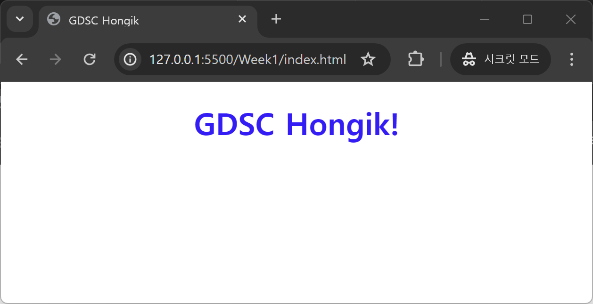

# Weekly I Learned 1

### Facebook과 웹의 역사

Facebook은 2004년부터 현재까지 20여년간 서비스하고 있는 대표적인 SNS(Social Network Service) 중 하나이다. 2012년에 월 사용자 10억명을 달성했을 만큼, 페이스북 웹 내에서는 그 사용자들이 생성해내는 수많은 상호작용이 존재한다.

이렇게 규모가 큰 웹 사이트인 만큼, 페이스북 개발자들은 어떻게 더 쾌적한 서비스를 만들 수 있을 지 고민했다. 그렇기에 웹의 최신 기술은 자연스레 페이스북과 함께하였는데, 이를 따라가며 페이스북과 웹의 역사에 대해 간단하게 알아보자.

- **2004년**

    페이스북이 탄생한 2004년에는 **LAMP 스택** 을 이용하여 웹을 개발하였다. 운영체제로 *Linux*, 웹 서버로 *Apache*, DBMS로 *MySQL*, 프로그래밍 언어로 *PHP*를 사용하는 4가지의 소프트웨어를 줄여서 **LAMP**라고 한다.

- **2010년**

    **jQuery** 라이브러리가 도입되어, 클라이언트에서 동작하는 Javascript 언어를 더욱 쉽게 작성할 수 있게 되었다. 실제로 jQuery의 모토는 *write less, do more.* 인 만큼 생산성 있는 개발이 가능하게 되었다.

    **AJAX**(Asynchronous Javascript And XML) 또한 도입되어서 웹 페이지가 서버와 비동기적으로 데이터를 교환할 수 있게 되었다. 이전까지는 좋아요 한 개만 눌러도 웹 페이지 전체의 HTML 코드를 새로 받아와야 한다는 문제가 있었으나, 이를 통해 페이지의 일부만 동적으로 변경하여 사용자 경험을 개선할 수 있었다.

- **2011년**

    점점 웹 페이지가 동적으로 변하고 복잡해지면서, Javascript 파일이 커지고 관리가 어려워졌다. 페이스북은 이 문제를 해결하기 위해 **React** 라이브러리를 개발하였다.

    **React** 라이브러리는 state 개념 및 JSX 문법을 활용하여 이러한 문제들을 해결하였다. 등장 초기에는 JSX 문법이 HTML과 Javascript를 한 곳에 두어서 관심사 분리 원칙에 위배된다며 불신의 의견도 있었으나, 이를 통해 컴포넌트를 선언적으로 작성하여 가상 DOM 조작을 효율적으로 할 수 있었기 때문에 점점 인정을 받게 된다.

    현재 **React**는 굉장히 빠른 속도로 발전하고 있다. 2023년 버전 18이 배포되었는데, 1년 뒤인 2024년에는 버전 19가 배포될 만큼 활발히 발전 중이다. 발전 속도에 비례해 인기 또한 많다. 현재 웹 프론트엔드 개발은 React 프레임워크가 Vue, Angular 등 다른 프레임워크에 비해 상당한 인기를 구가하고 있다.

---

### HTML & CSS

과제를 통해 HTML과 CSS 문법에 대하여 학습하며, 개인적으로 알아놓아야 할 필요성을 느낀 부분에 대하여 작성하였다.

- **꺽쇠 기호 넣기**

    html 코드에는 꺽쇠(<, >)가 많이 들어간다. 이 때문에 코드 내에 꺽쇠 기호를 넣으면, 중간의 단어를 태그라고 생각하고 단어가 사라지는 상황이 발생한다. 꺽쇠 기호를 올바르게 넣고 싶다면, `&lt;`(앰퍼샌드 less than ;), `&gt;`(앰퍼샌드 greater than ;) 을 통해서 넣어줘야 한다.

- **주석 넣기**

    html 코드에 주석을 삽입하려면, `<!--주석 내용-->`을 사용하자.

- **`a` 태그와 `link` 태그의 차이**

    `a`(anchor) 태그와 `link` 태그는 모두 속성으로 `href`를 받을 수 있어 헷갈릴 수 있다.

    - `link` 태그
        
        `head` 안에 작성하고, 현재 페이지를 외부 데이터와 연결한다. (ex. 폰트 파일 제공)

    - `a` 태그
        
        `body` 안에 작성하고, 클릭 시 해당 주소로 이동한다. (ex. 다른 웹 페이지 하이퍼링크)

- **필수 HTML 코드 편하게 입력하기**

    VS Code의 빈 HTML 문서에서 `!`를 입력하면 `head`, `body`, `title` 등 필수적으로 사용하는 HTML 기본 코드를 자동으로 입력할 수 있다.

- **HTML과 CSS 연결하기**

    `<link rel="stylesheet" href="style.css">`를 `head` 내에 적어주면 두 문서를 연결할 수 있다.

    - `rel="stylesheet"`
    
        링크된 리소스와 현재 html 파일 사이의 관계를 나타낸다. 

    - `href="style.css"`
    
        hypertext reference의 약자로, 링크할 주소를 지정한다.

- **`padding`, `margin`의 차이**

    style 속성으로 `padding`, `margin`을 부여할 수 있는데, `padding`은 안쪽 여백, `margin`은 바깥쪽 여백을 의미한다.

    - `padding: 40px 20px`

        안쪽 여백. 세로는 40px, 가로는 20px.

    - `margin: 10px 20px`

        바깥쪽 여백. 세로는 10px, 가로는 20px.

    - `margin: 0 auto`

        바깥쪽 여백. 세로는 0px (0은 px 생략 가능), 가로는 알아서 자동으로 채운다. 참고로, `auto`는 `margin`의 가로에서만 동작한다.

---

### Week 1 과제 사진

