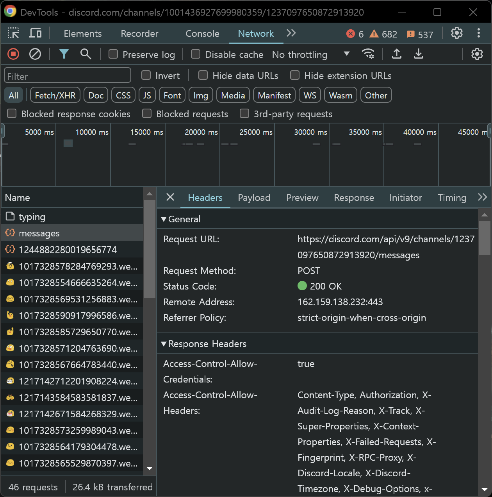
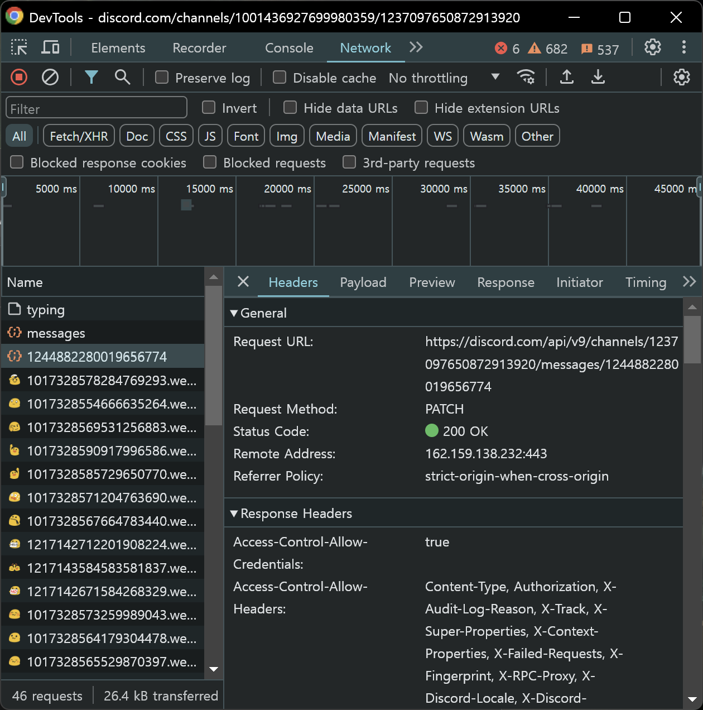
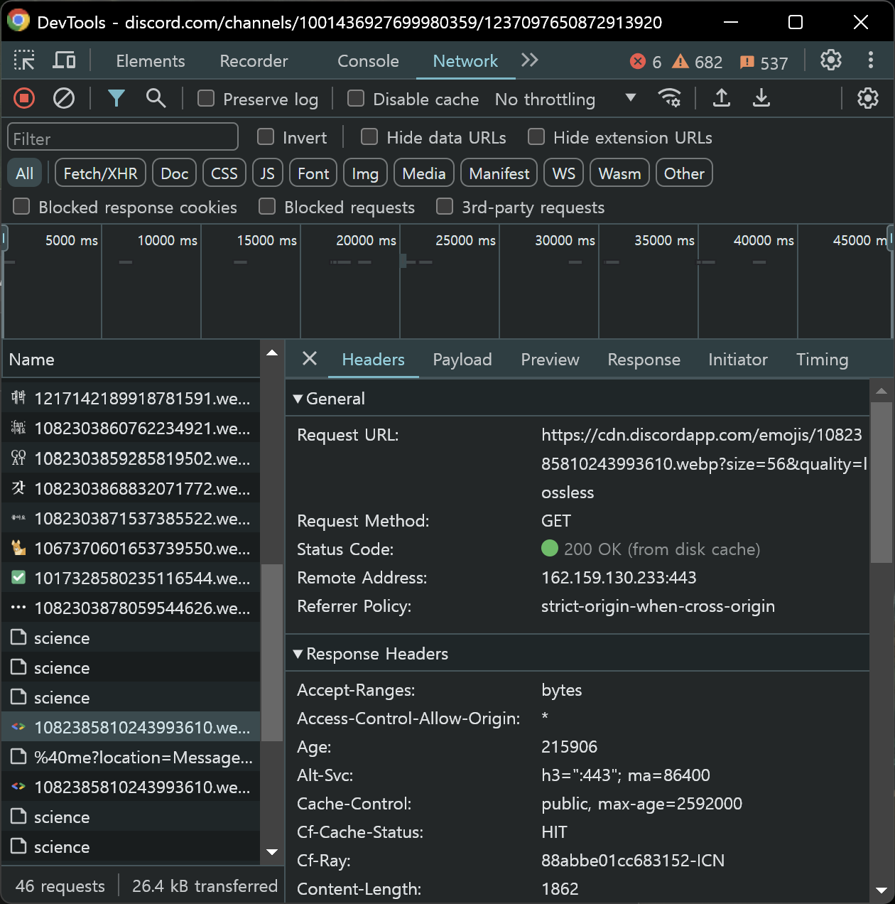
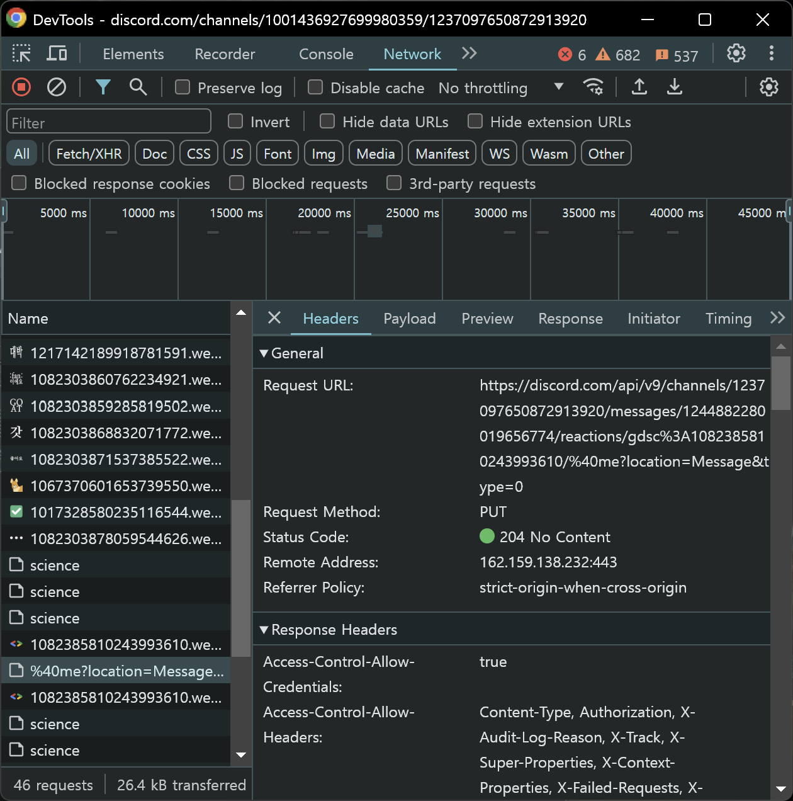
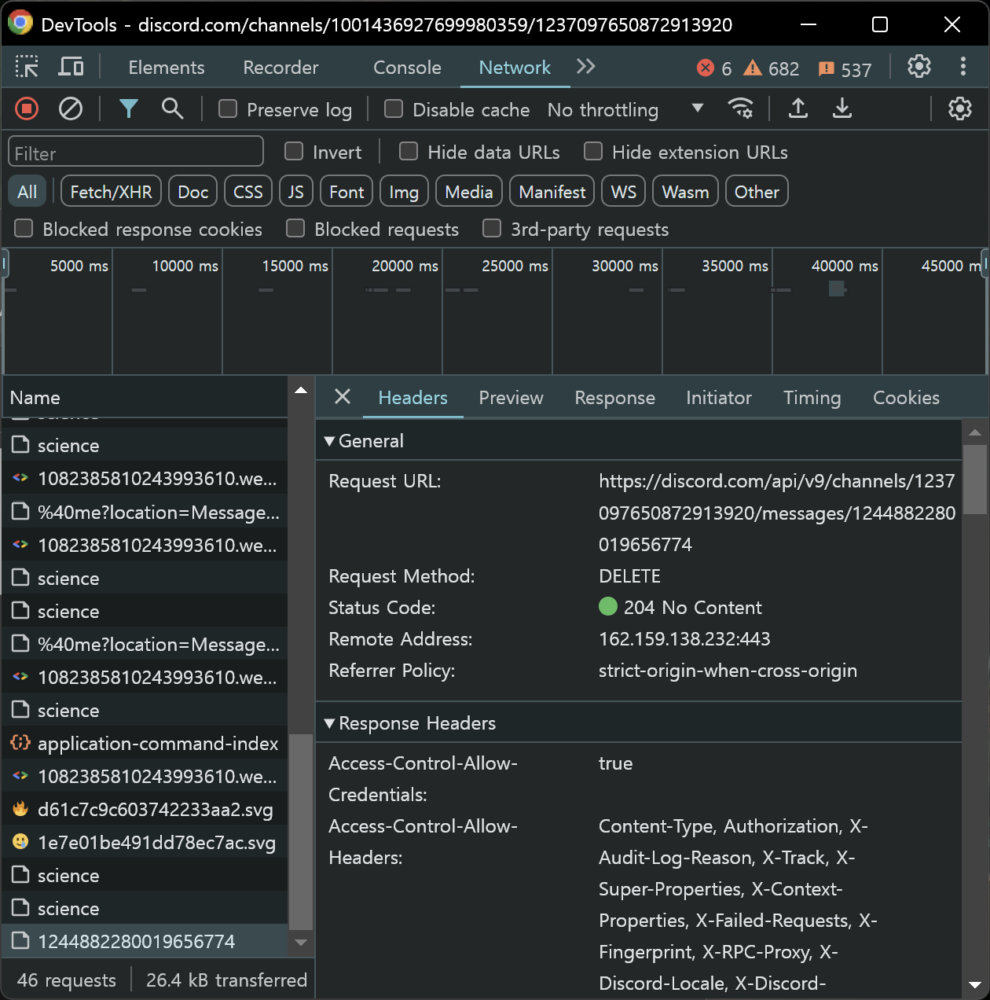

# Weekly I Learned 3

### HTTP란 무엇일까?

    HTTP는 Hyper Text Transfer Protocol의 약자로, html을 전달하기 위한 프로토콜이다. 

- **HTTP/1.1, HTTP/2 - TCP**

    HTTP/1.1과 HTTP/2는 공통적으로 TCP(Transmission Control Protocol)를 사용한다. 3-way-handshaking를 통하여 신뢰성이 보장되고, 데이터가 유실되었다면 확인하고 재전송하나, 이 때문에 전송 속도가 느리다.

- **HTTP/3 - UDP**

    HTTP/1의 느린 전송 속도를 개선하기 위해 HTTP/2가 개발되었으나, 현대의 대용량 데이터들이 통신하기에는 부족했다. 그래서 HTTP/3에서는 UDP(User Datagram Protocol) 방식을 기반으로 한 QUIC 방식이 쓰인다. UDP 방식은 과거에는 네트워크가 불안해서 패킷이 소실되는 경우가 많아 잘 쓰이지 않는 방식이었으나, 최근에는 네트워크가 발전했기 때문에 이러한 단점이 어느 정도 해결되었다. 그리고 기존 UDP 방식은 신뢰성이 보장되지 않았으나, QUIC 방식에서 신뢰성 또한 보장해주면서 UDP 기반의 빠른 속도와 더불어 신뢰성까지 얻게 되었다.

---

### GDSC Hongik Discord 서버와 HTTP 메서드

대표적인 HTTP 메서드로는 `GET`, `POST`, `PUT`, `PATCH`, `DELETE` 이렇게 5가지가 존재한다. GDSC Hongik Discord 서버에서 이 5가지를 모두 찾아볼 수 있는데, 메세지 흐름에 따라 이 메서드들이 어떻게 활용되는지 살펴보자.

- **POST**

    GDSC Hongik Discord 서버 내 임의의 채널에서 메세지를 보내 보았다. 이때, POST 요청을 통해, 이 채널에 나의 채팅 텍스트라는 새로운 리소스를 생성하였다.

    

- **PATCH**

    방금 보냈던 메시지에서 한 글자만 수정해보았다. POST를 통해 생성한 리소스에서, PATCH를 통해 채팅 텍스트만 부분적으로 대체되었다.

    

- **GET**

    방금 수정한 메시지에 반응을 달아보려고 반응 추가하기 창을 눌렀다. 서버 내에 존재하는 이모지들을 조회하기 위해 GET 메서드가 사용되었다.

    

- **PUT**

    반응 추가하기 창에서 반응을 선택해 반응을 달았다. 이때 PUT 메서드가 사용되었는데, 리소스가 없기 때문에 리소스를 생성했음을 알 수 있다.

    

- **DELETE**

    보냈던 메시지를 삭제했다. 리소스를 제거하기 위해 DELETE 메서드가 사용되었다.

    