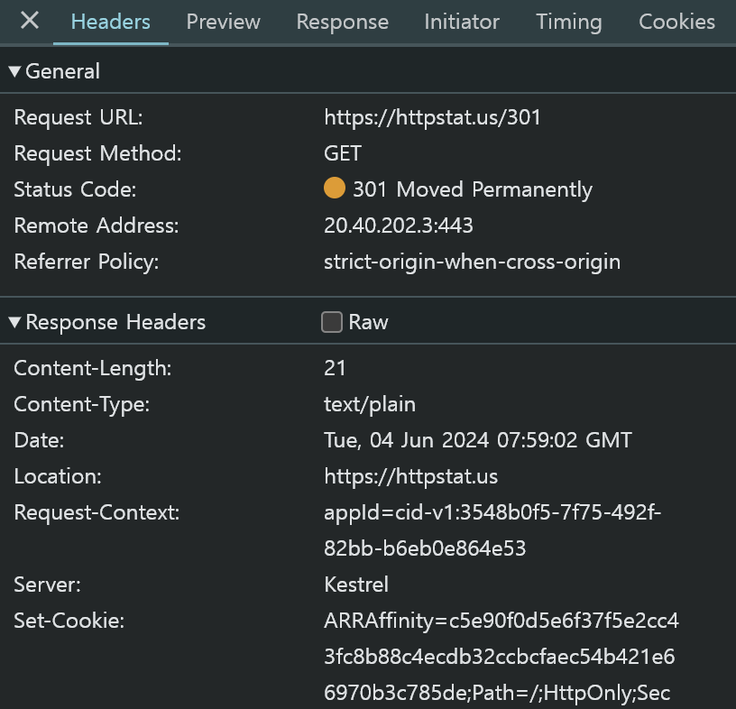
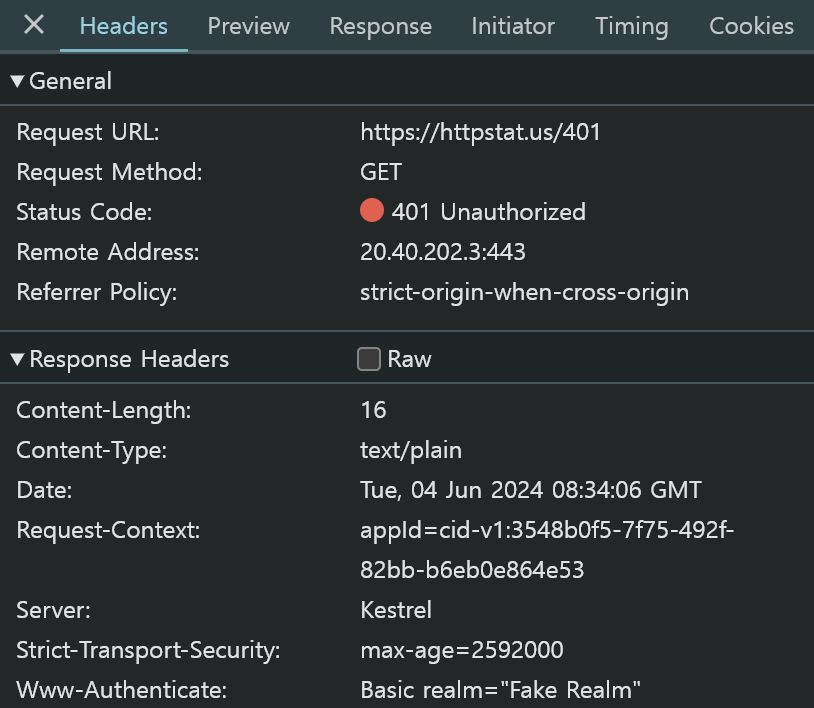
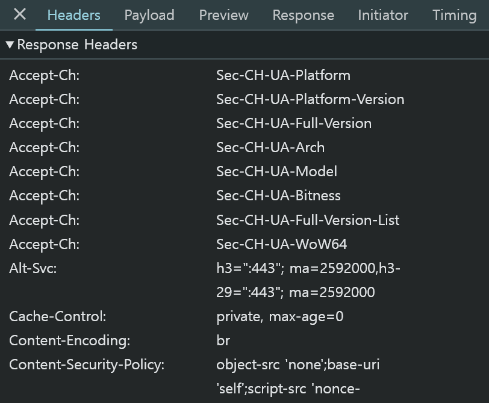
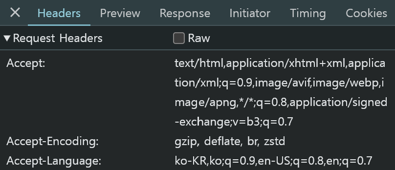
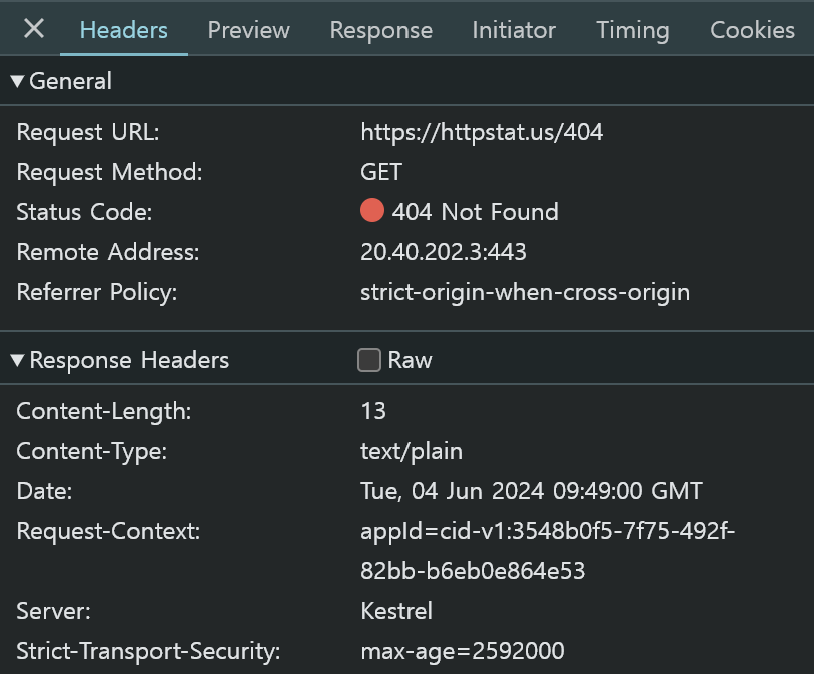

# Weekly I Learned 4

### HTTP 상태코드

- **100번대(Informational)**

    클라이언트의 요청을 받았고 작업을 진행중에 있음. 잘 사용하지 않는다.

- **200번대(Successful)**

    클라이언트의 요청을 성공적으로 처리하였음.

- **300번대(Redirection)**

    클라이언트의 요청을 끝마치기 위해 웹 브라우저의 추가적인 동작이 필요함. 서버 개발자가 설계를 잘 해야하는 부분이다.

- **400번대(Client Error), 500번대(Server Error)**

    400번대는 클라이언트 에러로 프론트엔드 문제일 가능성이 큼. 500번대는 서버 에러로 백엔드 문제일 가능성이 큼.

    웹을 개발할 때 에러가 발생하면, 상태코드를 보고 어느 부분이 설계가 잘못되었는지 파악한다. 만약 서버 개발자가 설계를 잘못해서 500번대 에러를 반환시켜야 할 것을 400번대로 반환하다면, 프론트엔드 쪽에서 아무리 해결하려 해도 고칠수 없다.

---

### [httpstat.us](httpstat.us)를 이용한 상태코드 분석

- **301, 303 요청을 하였을 때, 왜 httpstat.us 페이지의 메인으로 redirect될까?**
    
    301, 303은 Redirection이 필요한 상태코드로, 이 때문에 Response Header에서 Location 정보로 https://httpstat.us 를 넘겨주고 있기 때문이다.

    

- **401 요청을 하였을 때, 네트워크 탭의 상태를 보고 어떻게 인증해야 하는지 www-Authenticate 헤더를 기반으로 설명해보자.**

    클라이언트가 GET으로 리소스를 요청하면, 서버는 www-Authentication 헤더에 Basic 방법으로 인증을 진행할 것이라는 정보와, 접근하려는 영역에 대한 정보를 알려준다.

    클라이언트는 Basic 방법으로 증명한다는 정보와 인코딩된 로그인 정보를 넘겨주면 된다.

    

- **Google에 "Hello"를 입력하여 결과물을 보고, 네트워크 요청 탭에서 캐시 관련 정보가 어디에 저장되어 있는지 분석하여 보자.**

    응답 탭의 cache-control에 캐시 관련 정보가 저장되어 있다. max-age=0 이라는 뜻은, 0초의 유효기간을 가진 캐시를 준다는 것을 의미한다. 따라서 다음 요청도 fresh한 정보를 받을 수 있다.

    

- **더 알고 싶은 상태코드를 직접 체험해보고, 해당 상태코드에서 진행한 요청 헤더, 응답 헤더를 직접 정리하여 분석해보자.**

    - 404 Not Found의 협상 헤더 및 요청 헤더

        협상 헤더에서 Accept, Accept-Encoding, Accept-Language를 통해, 클라이언트가 선호하는 미디어 타입, 인코딩 방식, 그리고 자연어를 알 수 있다.

        사진에는 없으나, 요청 헤더에서 User-Agent를 통해, 클라이언트의 환경 정보를 알 수 있다. 실무에서 이를 통해 유저의 환경을 분석하여 디버깅 등에 활용할 수 있다.

        

    - 404 Not Found의 표현 헤더 및 응답 헤더

        표현 헤더에서 Content-Length와 Content-Type을 통해, 데이터가 13 Bytes 이며 text 형식임을 알 수 있다.

        응답 헤더에서 Date와 Server를 통해, GMT 기준 2024/06/04 9시 49분에 Kestrel 서버에서 응답을 처리했음을 알 수 있다.

        